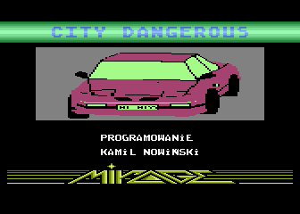

# Dangerous City

Gra napisana przeze mnie na 8-bitowe Atari w 1994 roku (miałem wtedy 16 lat).  
Przygotowałem dwie wersje: jedna z logo MIRAGE, druga z logo LK AVALON, jednak żadna z firm nie zdecydowała się na komercyjne wydanie tej gry.

Kodowanie: Kamil Nowiński  
Muzyka: Konrad Gmurek  
Okładka tytułowa: Hubert Nowiński  
Plansze: Kamil & Hubert  

## Historia
Tutaj przeczytasz więcej o tym jak zaczęła się cała historia i dlaczego ta gra wylądowała na GitHub:
[AtariOnline: CamoSoft / Kamilos - historia, programy](https://atarionline.pl/forum/comments.php?DiscussionID=6703)

# ATARI - Quick Assembler

Folder [src/QA](./src/QA/) zawiera oryginale pliki zrzucone z moich dyskietek, które przetrwały ponad 20 lat, najpierw w mieszkaniu, potem w piwnicy.

# PC - Assember dla środowiska C64 Studio

Folder [src/C64S](./src/C64S/) zawiera kompletną solucję i projekt pozwalający skompilować grę przy użyciu środowiska `C64 Studio`.

# PC - Assember dla MADS

Folder [src/MADS](./src/MADS/) zawiera zestaw plików pozwalający skompilować grę przy użyciu [Mad-Assembler](https://github.com/tebe6502/Mad-Assembler) (MADS).

# Jak zacząć?

Jeśli chcesz uruchomić program z kodu źródłowego pod platformą PC - [w tym folderze](./doc/) znajdziesz prezentację opisującą krok po kroku jak przygotować środowisko.

# Some numbers
- 24 x 14 tiles - each screen

