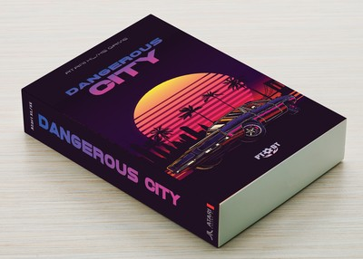
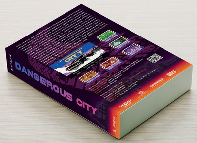
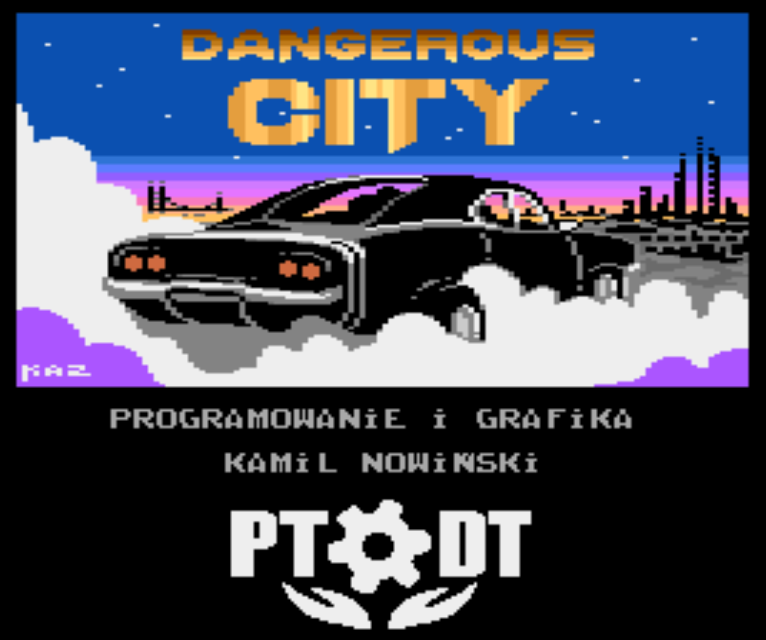
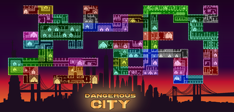

# Dangerous City 
Language: **English** | [Polish](README_PL.md)

A game I wrote for the 8-bit Atari in 1994 (I was 16 at the time).  
I prepared two versions: one with the MIRAGE logo, and another with the LK AVALON logo, but neither of the companies decided to commercially release the game.

Coding: **Kamil Nowiński**  
Music: **Konrad Gmurek**  
Title gfx: **Hubert Nowiński**  
Map: **Kamil & Hubert**  

# Edition 2023
Work on the new edition began back in 2022, when KAZ proposed releasing this title as part of the [Polish Society for the Protection of Technical Heritage](https://ptodt.org.pl/). We quickly established the preliminary scope of work, and [the full list of changes can be read here](./ChangeLog.md).  
Today, we already know that the game will be released on a cartridge, and the entire package will be available in a boxed version.

Box (front):  

Box (rear):  

Title Screen:  

Map:  

## History
Here you can read more about how the whole story began and why this game ended up on GitHub:  
[AtariOnline: CamoSoft / Kamilos - historia, programy](https://atarionline.pl/forum/comments.php?DiscussionID=6703)

## People who contributed to the game
Coding: **Kamil Nowiński**  
Title gfx: **Krzysztof "Kaz" Ziembik**  
Technical Support: **PEBE**  
Cartridge: **Jakub Husak**  
Box Design: **Rafał Dudek, Piotr Piter Krużycki, Krzysztof "Kaz" Ziembik**  

# ATARI - Quick Assembler

Folder [src/QA](./src/QA/) includes the original files copied from my disks, which survived for over 20 years, first in an apartment, then in a basement.

# PC - Assember for C64 Studio environment

The [src/C64S](./src/C64S/) folder contains a complete solution and project that allows you to compile the game using the `C64 Studio` environment.  
If you want to run the program from the source code on a PC platform – [in this folder](./doc/) you will find a presentation describing step by step how to set up the environment.  
> Please note that this version of the code is not fully compatible with QA.  

To achieve full compatibility and greater capabilities – the entire code has been prepared in the next folder: MADS (read below).

# PC - Assember dla MADS

The [src/MADS](./src/MADS/) folder contains a set of files that allow you to compile the game using [Mad-Assembler](https://github.com/tebe6502/Mad-Assembler) (MADS).

# Some numbers
- 24 x 14 tiles - each screen
- The map contains 71 screens

# References
Meaning who talked about it, wrote about it, promoted it.  
- [PTODT released game „Dangerous City”](https://ptodt.org.pl/wszyscy/ptodt-wydal-gre-dangerous-city/)
- Buy: [Atari Fan: “Dangerous City” game](https://atarifan.pl/produkt/gra-dangerous-city/)
- AtariOnline: [New game "Dangerous City"](https://www.atarionline.pl/v01/index.php?subaction=showfull&id=1679674438&archive=&start_from=0&ucat=1&ct=nowinki)
- Atariki: [Dangerous City](http://atariki.krap.pl/index.php/Dangerous_City)
- Video: [Atari XL/XE -=Dangerous City=- unboxing&gameplay](https://youtu.be/GSyYBSiwLzA)

