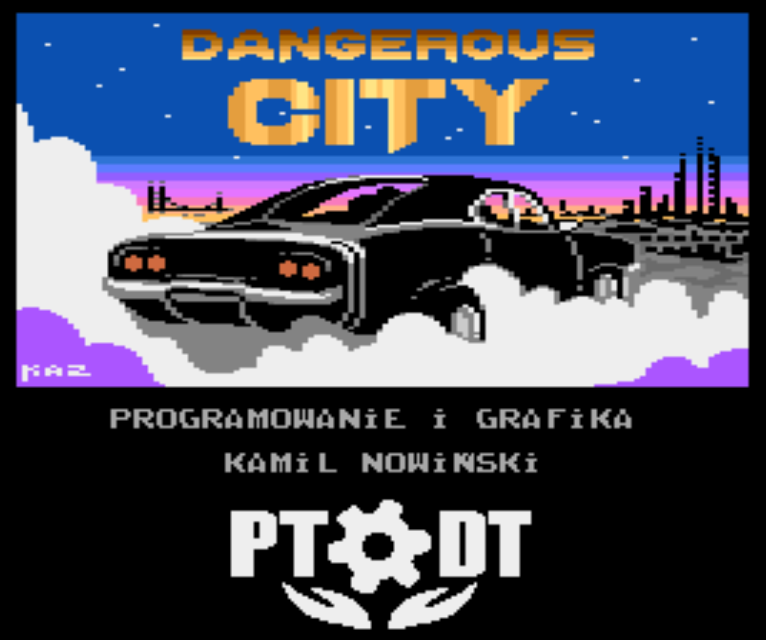

# Dangerous City 
Language: [English](README.md) | **Polish**

Gra napisana przeze mnie na 8-bitowe Atari w 1994 roku (miałem wtedy 16 lat).  
Przygotowałem dwie wersje: jedna z logo MIRAGE, druga z logo LK AVALON, jednak żadna z firm nie zdecydowała się na komercyjne wydanie tej gry.

Kodowanie: **Kamil Nowiński**  
Muzyka: **Konrad Gmurek**  
Okładka tytułowa: **Hubert Nowiński**  
Plansze: **Kamil & Hubert**  

# Edycja 2023
Prace nad nową edycją ruszyły jeszcze w 2022r, kiedy to KAZ zaproponował wydanie tego tytułu w ramach [Polskiego Towarszystwa Ochrony Dziedzictwa Technicznego](https://ptodt.org.pl/). Szybko ustaliliśmy wstępny zakres prac, a [pełną listę zmian można przeczytać tutaj](./ChangeLog.md).
Dzisiaj już wiemy, że gra zostanie wydana na cartridge'u, a całość pojawi się w wersji pudełkowej.

Pudełko (front):  

Pudełko (tył):  

Ekran tytułowy:  

Mapa:  

## Historia
Tutaj przeczytasz więcej o tym jak zaczęła się cała historia i dlaczego ta gra wylądowała na GitHub:
[AtariOnline: CamoSoft / Kamilos - historia, programy](https://atarionline.pl/forum/comments.php?DiscussionID=6703)

## Osoby, które przyczyniły się do gry
Kodowanie: **Kamil Nowiński**  
Grafika tytułowa: **Krzysztof "Kaz" Ziembik**  
Wsparcie techniczne: **PEBE**  
Cartridge: **Jakub Husak**  
Projekt pudełka: **Rafał Dudek, Piotr Piter Krużycki, Krzysztof "Kaz" Ziembik**  

# ATARI - Quick Assembler

Folder [src/QA](./src/QA/) zawiera oryginale pliki zrzucone z moich dyskietek, które przetrwały ponad 20 lat, najpierw w mieszkaniu, potem w piwnicy.

# PC - Assember dla środowiska C64 Studio

Folder [src/C64S](./src/C64S/) zawiera kompletną solucję i projekt pozwalający skompilować grę przy użyciu środowiska `C64 Studio`.  
Jeśli chcesz uruchomić program z kodu źródłowego pod platformą PC - [w tym folderze](./doc/) znajdziesz prezentację opisującą krok po kroku jak przygotować środowisko.  
> Miej na uwadze, że ta wersja kodu nie jest w pełni kompatybilna z QA. 

Aby uzyskać pełną kompatybilność i większe możliwości - cały kod został przygotowany w kolejnym folderze: MADS (czytaj niżej).

# PC - Assember dla MADS

Folder [src/MADS](./src/MADS/) zawiera zestaw plików pozwalający skompilować grę przy użyciu [Mad-Assembler](https://github.com/tebe6502/Mad-Assembler) (MADS).

# Some numbers
- 24 x 14 tiles - each screen
- Mapa zawiera 71 ekranów

# Referencje
Czyli kto o tym mówił, pisał, promował.  
- [PTODT wydał grę „Dangerous City”](https://ptodt.org.pl/wszyscy/ptodt-wydal-gre-dangerous-city/)
- Buy: [Atari Fan: Gra “Dangerous City”](https://atarifan.pl/produkt/gra-dangerous-city/)
- AtariOnline: [Nowa gra "Dangerous City"](https://www.atarionline.pl/v01/index.php?subaction=showfull&id=1679674438&archive=&start_from=0&ucat=1&ct=nowinki)
- Atariki: [Dangerous City](http://atariki.krap.pl/index.php/Dangerous_City)
- Video: [Atari XL/XE -=Dangerous City=- unboxing&gameplay](https://youtu.be/GSyYBSiwLzA)

